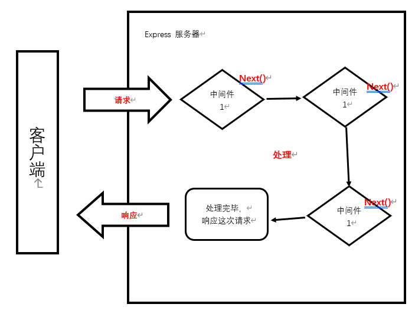

# Express(框架)

## 一、Express 介绍

express 是一个基于 Node.js 平台的极简、灵活的 WEB 应用开发框架，官方网址：https://www.expressjs.com.cn/  
简单来说，express 是一个封装好的工具包，封装了很多功能，便于我们开发 WEB 应用（HTTP 服务）

## Express 使用

### 1.1 Express 下载

```终端
npm install express --save
或
npm i express
```

### 1.2 express 初体验

大家可以按照这个步骤进行操作：

1. 创建 JS 文件，键入如下代码

```javascript
//1. 导入 express
const express = require("express");
//2. 创建应用对象
const app = express();
//3. 创建路由规则
app.get("/home", (req, res) => {
  res.end("hello express server");
});
//4. 监听端口 启动服务
app.listen(3000, () => {
  console.log("服务已经启动, 端口监听为http://127.0.0.1:3000/home");
});
```

> 我想你已经发现 res.end 发送的响应设置为中文时，页面显示乱码。
> 将 app.get 替换成这个：
>
> ```javascript
> app.get("/home", (req, res) => {
>   res.writeHead(200, { "Content-Type": "text/plain; charset=utf-8" });
>   res.end("你访问到了home路径");
> });
> ```

这里使用了 res.writeHead() 方法来设置响应头，指定 Content-Type 为 "text/plain; charset=utf-8"。然后使用 res.end() 方法发送带有正确编码的字符串作为响应正文。

这样修改后，当用户访问 "/home" 路径时，在浏览器中应该能够正确地显示中文字符了。

2.  命令行下执行该脚本  
    <mark>文件名为入口文件一般默认为 index.js 或者 app.js</mark>

```终端
node <文件名>
# 或者
nodemon <文件名>
```

3. 然后在浏览器就可以访问 http://127.0.0.1:3000/home

## 二、Express 路由

### 2.1 什么是路由

官方定义：<mark>路由确定了应用程序如何响应客户端对特定端点的请求</mark>

### 2.2 路由的使用

一个路由的组成有<mark>请求方法</mark>,<mark>路径</mark>和<mark>回调函数</mark>组成
express 中提供了一系列方法，可以很方便的使用路由，使用格式如下：

```javascript
app.<method>(path，callback)
```

代码示例：

```javascript
//导入 express
const express = require("express");
//创建应用对象
const app = express();
//创建 get 路由
app.get("/home", (req, res) => {
  res.send("网站首页");
});
//首页路由
app.get("/", (req, res) => {
  res.send("我才是真正的首页");
});
//创建 post 路由
app.post("/login", (req, res) => {
  res.send("登录成功");
});
//匹配所有的请求方法
app.all("/search", (req, res) => {
  res.send("1 秒钟为您找到相关结果约 100,000,000 个");
});
//自定义 404 路由
app.all("*", (req, res) => {
  res.send("<h1>404 Not Found</h1>");
});
//监听端口 启动服务
app.listen(3000, () => {
  console.log("服务已经启动, 端口监听为http://127.0.0.1:3000/");
});
```

### 2.3 获取请求参数

express 框架封装了一些 API 来方便获取请求报文中的数据，并且兼容原生 HTTP 模块的获取方式

```javascript
//导入 express
const express = require("express");
//创建应用对象
const app = express();
//获取请求的路由规则
app.get("/request", (req, res) => {
  //1. 获取报文的方式与原生 HTTP 获取方式是兼容的
  console.log(req.method);
  console.log(req.url);
  console.log(req.httpVersion);
  console.log(req.headers);
  //2. express 独有的获取报文的方式
  //获取查询字符串
  console.log(req.query); // 『相对重要』
  // 获取指定的请求头
  console.log(req.get("host"));
  res.send("请求报文的获取");
});
//启动服务
app.listen(3000, () => {
  console.log("启动成功http://127.0.0.1:3000/");
});
```

这个示例代码演示了如何使用 Express 获取 HTTP 请求的各种属性，包括请求方法、URL、HTTP 版本、请求头、查询字符串等等。使用这些属性，我们可以编写出更加灵活和高效的 web 应用程序。

### 2.4 获取路由参数

路由参数指的是<mark>URL 路径中的参数（数据）</mark>

```javascript
const express = require("express");
//创建应用对象
const app = express();

app.get("/:id.html", (req, res) => {
  res.send("商品详情, 商品 id 为" + req.params.id);
});

app.listen(3000, () => {
  console.log("服务已经启动，端口监听为 http://127.0.0.1:3000");
});
```

这个路由规则指定当用户访问以<mark>"/:id.html"</mark>形式的路径时，应用程序将执行这个回调函数。在这个回调函数中，我们可以使用<mark>req.params</mark>对象来获取<mark>URL 中的参数值</mark>。注意，这里使用的是<mark>动态路由</mark>的形式，即<mark>URL 中的参数值是动态的</mark>。

## 三、express 响应设置

express 框架封装了一些 API 来方便给客户端响应数据，并且兼容原生 HTTP 模块的获取方式

```javascript
const express = require("express");
//创建应用对象
const app = express();

//获取请求的路由规则
app.get("/response", (req, res) => {
  //1. express 中设置响应的方式兼容 HTTP 模块的方式
  res.statusCode = 404;
  res.statusMessage = "xxx";
  res.setHeader("abc", "xyz");
  res.write("响应体");
  res.end("xxx");
  //2. express 的响应方法
  res.status(500); //设置响应状态码
  res.set("xxx", "yyy"); //设置响应头
  res.send("中文响应不乱码"); //设置响应体
  //连贯操作
  res.status(404).set("xxx", "yyy").send("你好朋友");
  //3. 其他响应
  res.redirect("http://atguigu.com"); //重定向
  res.download("./package.json"); //下载响应
  res.json(); //响应 JSON
  res.sendFile(__dirname + "/home.html"); //响应文件内容
});

app.listen(3000, () => {
  console.log("服务已经启动，端口监听为 http://127.0.0.1:3000");
});
```

## 四、express 中间件

### 4.1 什么是中间件

<mark>中间件（Middleware）本质是一个回调函数</mark>  
<mark>中间件函数</mark>可以像路由回调一样访问<mark>请求对象（request）</mark>，<mark>响应对象（response）</mark>

### 4.2 中间件的作用

<mark>中间件的作用</mark>就是<mark>使用函数封装公共操作，简化代码</mark>

### 4.3 中间件的类型

- 全局中间件
- 路由中间件

#### 4.3.1 定义全局中间件

<mark>每一个请求</mark>到达服务端之后<mark>都会执行全局中间件函数</mark>

声明中间件函数

```javascript
let recordMiddleware = function (request, response, next) {
  //实现功能代码
  //执行next函数(当如果希望执行完中间件函数之后，仍然继续执行路由中的回调函数，必须调用next)
  // next函数是实现多个中间件连续调用的关键，它表示把流转关系转交给下一个中间件或路由。
  next();
};
```



应用中间件

```javascript
app.use(recordMiddleware);
```

声明时可以直接将匿名函数传递给<mark>use</mark>

```javascript
app.use(function (request, response, next) {
  console.log("定义第一个中间件");
  next();
});
```

使用例子：

```javascript
const express = require("express");
const app = express();

// 使用 express.static 中间件将 public 目录下的静态资源映射到 Express 应用程序中
app.use(express.static("public"));

// 定义根路由
app.get("/index", (req, res) => {
  // 返回 index.html 文件
  res.sendFile(__dirname + "/public/shu1.html");
});
app.get("/", (req, res) => {
  // 可以用下面的方法写界面，也可直接链接（推荐链接）
  res.send(`
    <!DOCTYPE html>
<html lang="en">
  <head>
    <meta charset="UTF-8" />
    <meta http-equiv="X-UA-Compatible" content="IE=edge" />
    <meta name="viewport" content="width=device-width, initial-scale=1.0" />
    <title>主页</title>
    <style type="text/css">
    #box{
        background-color:red;
    }
    </style>
    </head>
    <body>
    <div id="box"><a href="./index">路由index主页</a></div>
    </body>
    </html>
    `);
});
app.all("*", (req, res) => {
  res.send("<h1>404 Not Found</h1>");
});
// 启动服务
app.listen(3000, () => {
  console.log("服务已经启动，端口监听为 http://127.0.0.1:3000");
});
```

> res.sendFile() 函数用于将指定的文件作为响应的主体发送到客户端。它接受一个文件路径作为参数，该路径可以是绝对路径或相对路径，如果是相对路径，将基于 Node.js 进程的当前工作目录来解析路径。  
> 这个例子中，res.sendFile(**dirname + "/public/shu2.html") 表示将位于当前文件所在目录下的 public/shu2.html 文件作为响应主体发送到客户端。**dirname 是一个全局变量，表示当前模块所在的目录的绝对路径。因此,\_dirname + "/public/shu2.html" 的值是当前文件所在目录下的 public/shu2.html 文件的绝对路径。

public 文件里的 shu1.html 文件

```html
<!DOCTYPE html>
<html lang="en">
  <head>
    <meta charset="UTF-8" />
    <meta http-equiv="X-UA-Compatible" content="IE=edge" />
    <meta name="viewport" content="width=device-width, initial-scale=1.0" />
    <title>Document</title>
    <style>
      .box {
        width: 100px;
        height: 100px;
        background-color: brown;
        color: aliceblue;
        white-space: nowrap;
        /* 一行显示 */
        overflow: hidden;
        text-overflow: ellipsis;
        /* 超出部分用...号替代 */
      }
      .aa {
        width: 200px;
        background-color: rgb(196, 226, 62);
        display: -webkit-box;
        -webkit-box-orient: vertical;
        -webkit-line-clamp: 2;
        overflow: hidden;
      }
    </style>
  </head>
  <body>
    <div class="box">111111111111111</div>
    <div class="aa">
      哇哇哇哇哇哇哇哇哇哇哇哇哇哇哇哇哇哇嗡嗡嗡嗡嗡嗡嗡嗡嗡嗡嗡嗡嗡嗡嗡嗡嗡嗡哇
    </div>
  </body>
</html>
```

#### 4.3.2 多个全局中间件

express 允许使用 app.use() 定义多个全局中间件

```javascript
app.use(function (request, response, next) {
  console.log("定义第一个中间件");
  next();
});
app.use(function (request, response, next) {
  console.log("定义第二个中间件");
  next();
});
```

#### 4.3.3 定义路由中间件

如果<mark>只需要对某一些路由进行功能封装</mark>，则就需要路由中间件
调用格式如下：

```javascript
app.get("/路径", `中间件函数`, (request, response) => {});
app.get("/路径", `中间件函数1`, `中间件函数2`, (request, response) => {});
```

### 4.4 静态资源中间件

express 内置处理静态资源的中间件

```javascript
//引入express框架
const express = require("express");
//创建服务对象
const app = express();
//静态资源中间件的设置，将当前文件夹下的public目录作为网站的根目录
app.use(express.static("./public")); //当然这个目录中都是一些静态资源
//如果访问的内容经常变化，还是需要设置路由
//但是，在这里有一个问题，如果public目录下有index.html文件，单独也有index.html的路由，
//则谁书写在前，优先执行谁
app.get("/index.html", (request, response) => {
  respsonse.send("首页");
});
//监听端口
app.listen(3000, () => {
  console.log("3000 端口启动....");
});
```

> 注意事项:
>
> 1. index.html 文件为默认打开的资源
> 2. 如果静态资源与路由规则同时匹配，谁先匹配谁就响应
> 3. 路由响应动态资源，静态资源中间件响应静态资源

```javascript
const express = require("express");
const app = express();

// 使用 express.static 中间件将 public 目录下的静态资源映射到 Express 应用程序中
app.use(express.static("public"));

// 定义根路由
app.get("/index", (req, res) => {
  // 返回 index.html 文件
  res.sendFile(__dirname + "/public/shu1.html");
});
app.get("/", (req, res) => {
  res.send(`
    <!DOCTYPE html>
<html lang="en">
  <head>
    <meta charset="UTF-8" />
    <meta http-equiv="X-UA-Compatible" content="IE=edge" />
    <meta name="viewport" content="width=device-width, initial-scale=1.0" />
    <title>主页</title>
    <style type="text/css">
    a{
      color:#ffffff;
    }
    #box{
        background-color:red;
    }
    </style>
    </head>
    <body>
    <div id="box"><a href="./index">路由index主页</a></div>
    <div id="box"><a href="./aaa">导航</a></div>
    <div id="box"><a href="./bbb">佛祖</a></div>
    </body>
    </html>
    `);
});
app.get("/renc", (red, res) => {
  res.sendFile(__dirname + "/public/shu2.html");
});
app.get("/aaa", (red, res) => {
  res.sendFile(__dirname + "/public/shu3.html");
});
app.get("/bbb", (red, res) => {
  res.sendFile(__dirname + "/public/shu4.html");
});
app.all("*", (req, res) => {
  res.send("<h1>404 Not Found</h1>");
});
// 启动服务
app.listen(3000, () => {
  console.log("服务已经启动，端口监听为 http://127.0.0.1:3000");
});
```

> 多个路由，使用

### 4.5 获取请求体数据 body-parser

express 可以使用<mark>body-parser</mark>包处理请求体
第一步：安装

```终端
npm i body-parser
```

第二步：导入 body-parser 包

```javascript
const bodyParser = require("body-parser");
```

第三步：获取中间件函数

```javascript
//处理 querystring 格式的请求体
let urlParser = bodyParser.urlencoded({extended:false}));
//处理 JSON 格式的请求体
let jsonParser = bodyParser.json();
```

第四步：设置路由中间件，然后使用<mark>request.body</mark>来获取请求体数据

```javascript
app.post("/login", urlParser, (request, response) => {
  //获取请求体数据
  //console.log(request.body);
  //用户名
  console.log(request.body.username);
  //密码
  console.log(request.body.userpass);
  response.send("获取请求体数据");
});
```

获取到的请求体数据：

```终端
[Object: null prototype] { username: 'admin', userpass: '123456' }
```

## 五、Router

### 6.1 什么是 Router

express 中的 Router 是一个完整的中间件和路由系统，可以看做是一个小型的 app 对象。

### 6.2 Router 作用

对路由进行模块化，更好的管理路由

### 6.3 Router 使用

创建独立的 JS 文件（homeRouter.js）

```javascript
//1. 导入 express
const express = require("express");
//2. 创建路由器对象
const router = express.Router();
//3. 在 router 对象身上添加路由
router.get("/", (req, res) => {
  res.send("首页");
});
router.get("/cart", (req, res) => {
  res.send("购物车");
});
//4. 暴露
module.exports = router;
```

主文件

```javascript
const express = require("express");
const app = express();
//5.引入子路由文件
const homeRouter = require("./routes/homeRouter");
//6.设置和使用中间件
app.use(homeRouter);
app.listen(3000, () => {
  console.log("3000 端口启动....");
});
```

## 六、EJS 模板引擎

### 6.1 什么是模板引擎

模板引擎是分离<mark>用户界面和业务数据</mark>的一种技术

### 6.2 什么是 EJS

EJS 是一个高效的 Javascript 的模板引擎  
官网: https://ejs.co/  
中文站：https://ejs.bootcss.com/

### 6.3 EJS 初体验

下载安装 EJS

```终端
npm install ejs
或
npm i ejs --save
```

代码示例

```javascript
//1.引入ejs
const ejs = require('ejs');
//2.定义数据
let person = ['张三','李四','王二麻子'];
//3.ejs解析模板返回结构
//<%= %> 是ejs解析内容的标记，作用是输出当前表达式的执行结构
let html = ejs.render(‘<%= person.join(",") %>’, {person:person});
//4.输出结果
console.log(html);
```

命令行下运行

### 6.4 EJS 常用语法

执行 JS 代码

```终端
<% code %>
```

输出转义的数据到模板上

```终端
<%= code %>
```

输出非转义的数据到模板上

```终端
<%- code %>
```
