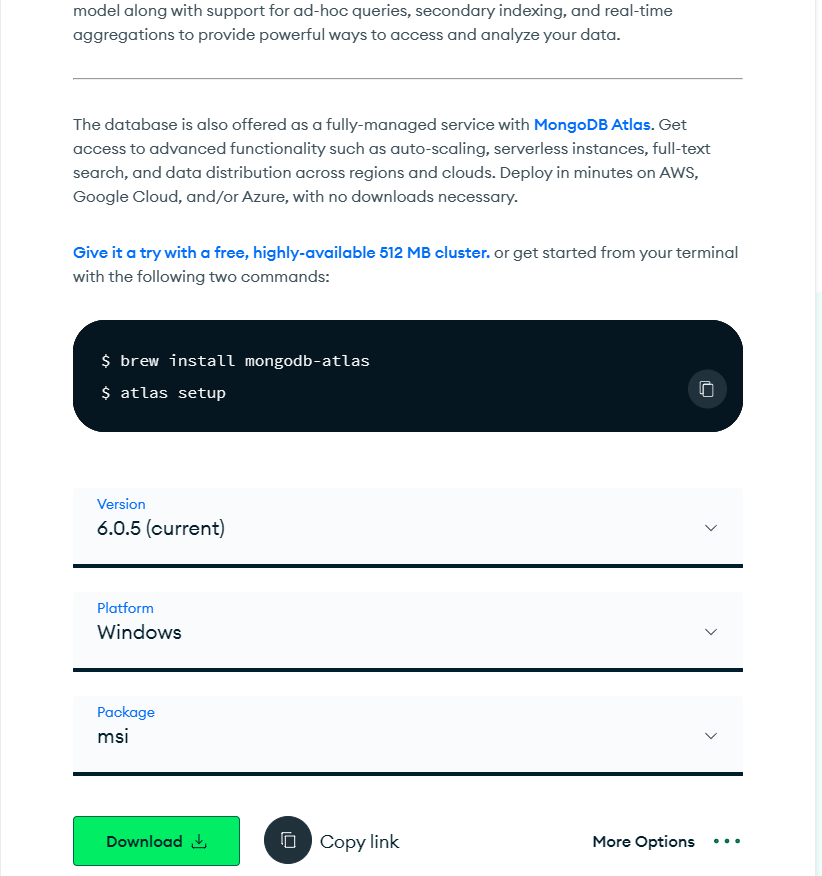
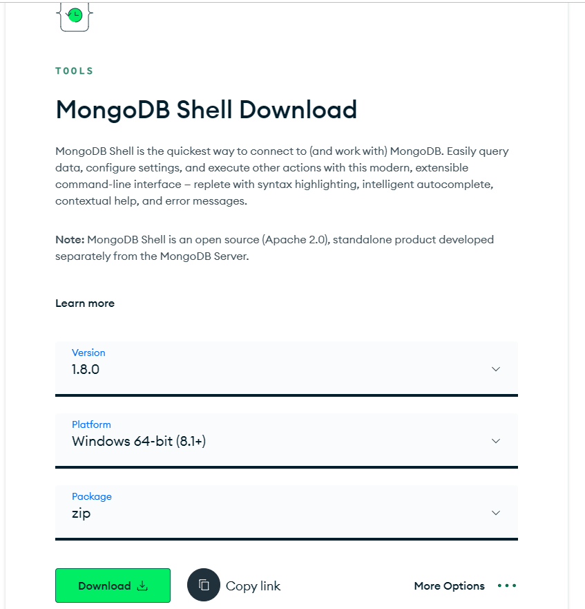
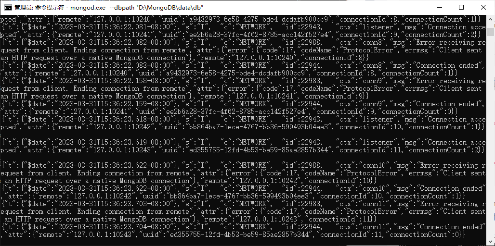
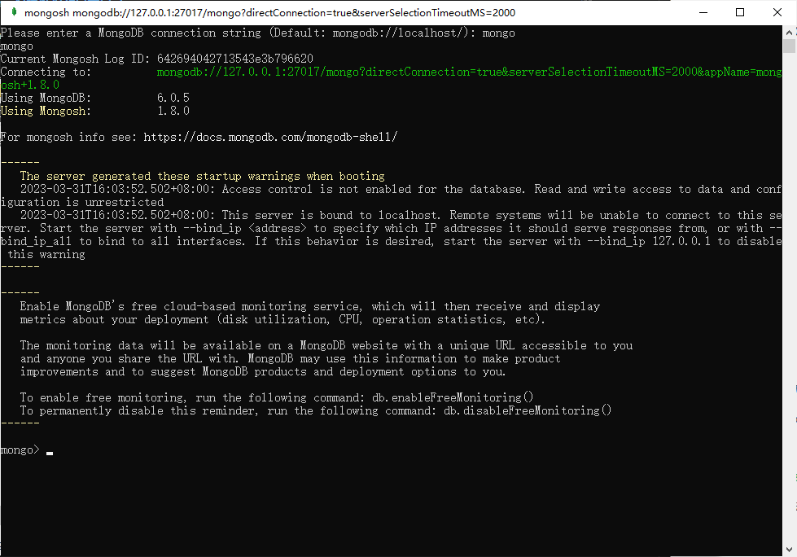

# MongoDB

## 一、简介

### 1.1 Mongodb 是什么

MongoDB 是一个基于分布式文件存储的数据库，官方地址 https://www.mongodb.com/

### 1.2 数据库是什么

数据库（DataBase）是按照数据结构来组织、存储和管理数据的 应用程序

### 1.3 数据库的作用

数据库的主要作用就是 管理数据 ，对数据进行 增（c）、删（d）、改（u）、查（r）

### 1.4 数据库管理数据的特点

相比于纯文件管理数据，数据库管理数据有如下特点：

1. 速度更快
2. 扩展性更强
3. 安全性更强

### 1.5 为什么选择 Mongodb

操作语法与 JavaScript 类似，容易上手，学习成本低

## 二、核心概念

Mongodb 中有三个重要概念需要掌握
数据库（database） 数据库是一个数据仓库，数据库服务下可以创建很多数据库，数据库中可以存
放很多集合
集合（collection） 集合类似于 JS 中的数组，在集合中可以存放很多文档
文档（document） 文档是数据库中的最小单位，类似于 JS 中的对象

JSON 文件示例：

```json
{
  "accounts": [
    {
      "id": "3-YLju5f3",
      "title": "买电脑",
      "time": "2023-02-08",
      "type": "-1",
      "account": "5500",
      "remarks": "为了上网课"
    },
    {
      "id": "3-YLju5f4",
      "title": "请女朋友吃饭",
      "time": "2023-02-08",
      "type": "-1",
      "account": "214",
      "remarks": "情人节聚餐"
    },
    {
      "id": "mRQiD4s3K",
      "title": "发工资",
      "time": "2023-02-19",
      "type": "1",
      "account": "4396",
      "remarks": "终于发工资啦!~~"
    }
  ],
  "users": [
    {
      "id": 1,
      "name": "zhangsan",
      "age": 18
    },
    {
      "id": 2,
      "name": "lisi",
      "age": 20
    },
    {
      "id": 3,
      "name": "wangwu",
      "age": 22
    }
  ]
}
```

大家可以通过 JSON 文件来理解 Mongodb 中的概念
一个 JSON 文件 好比是一个 数据库 ，一个 Mongodb 服务下可以有 N 个数据库
JSON 文件中的 一级属性的数组值 好比是 集合
数组中的对象好比是 文档
对象中的属性有时也称之为 字段

> 一般情况下
>
> - 一个项目使用一个数据库
> - 一个集合会存储同一种类型的数据

## 三、下载安装与启动

### 下载 mongodb

直接进入到官网->[MongoDB Shell Download | MongoDB](https://www.mongodb.com/try/download/community)

我这里下载的是 zip，一般直接无脑 next 即可。安装目录随意。我这里安装在 D:\MongoDB 下。


还需要下载一下 MongoShell。->[MongoDB Shell Download | MongoDB](https://www.mongodb.com/try/download/shell)



可以解压在 MongoDB 的目录下，我这里解压在 E:\MongoDB\MongoShll 目录下

### 配置

#### 创建数据和日志目录

MongoDB 将数据目录存储在 db 目录下。但是这个数据目录不会主动创建，我们在安装完成后需要创建它。我创建的路径为<mark>E:\MongoDB\data\db</mark>。

日志文件创建的路径为<mark>E:\MongoDB\log</mark>。

### 启动 MongoDB 服务

在 win 系统下有两种启动方式：

1. 命令行启动方式

2. 配置文件方式，选择其一即可。

#### 1. 命令行启动

cd 到 mongodb 目录的 bin 目录下执行

```终端
mongod.exe --dbpath "D:\MongoDB\data\db"
```

或者直接执行：(注意使用自己的路径)

```终端
"D:\MongoDB\mongodb\bin\mongod.exe" --dbpath "D:\MongoDB\data\db"
```

如果执行成功会看到以下信息:


此时需要打开<mark>MongoShll\bin</mark>目录下的<mark>mongosh.exe</mark>,然后输入 mongo 即可进入到 mongodb 的交互式环境。在这里就可以大展宏图啦~

```终端
mongo
```



### 查看 MongoDB 是否启动

1. 直接在浏览器窗口输入 localhost:27017。看到如下图所示提示，就是启动成功了。


```
http://127.0.0.1:27017/
```

## 四、命令行交互

命令行交互一般是学习数据库的第一步，不过这些命令在后续用的比较少，所以大家了解即可

### 4.1 数据库命令

1. 显示所有的数据库

```powershell
   show dbs
```

2. 切换到指定的数据库，如果数据库不存在会自动创建数据库

```powershell
   use 数据库名
```

3. 显示当前所在的数据库

```powershell
   db
```

4. 删除当前数据库

```powershell
   use 库名
   db.dropDatabase()
```

### 4.2 集合命令

1. 创建集合

```powershell
   db.createCollection('集合名称')
```

2. 显示当前数据库中的所有集合

```powershell
   show tables
   或
   show collections
```

3. 删除某个集合

```powershell
db.集合名.drop()
```

4. 重命名集合

```powershell
db.集合名.renameCollection('newName')

```

### 4.3 文档命令

1. 插入文档

```powershell
db.集合名.insert(文档对象);
例如
db.集合名.insert({"name":"你好"})
```

2. 查询文档

```powershell
db.集合名.find(查询条件)//可以不写查询条件
例如
 db.集合名.find().pretty()
[ { _id: ObjectId("642a59ca2abc6d8f5c5cccfd"), name: '你好' } ]
```

<mark>\_id 是 mongodb 自动生成的唯一编号，用来唯一标识文档</mark>

3. 更新文档

```powershell
db.集合名.update(查询条件,新的文档)
db.集合名.update({name:'张三'},{$set:{age:19}})
```

4. 删除文档

```powershell
db.集合名.remove(查询条件)
```

## 使用 node 操作 MOngoose

### 4.1 使用流程

```javascript
//1. 安装 mongoose
npm install mongodb --save
//2. 导入 mongoose
const fs = require("fs");
const express = require("express");
const mongoose = require("mongoose");
const uri = "mongodb://127.0.0.1:27017/ceshi";//ceshi链接集合
mongoose.connect(uri, { useNewUrlParser: true, useUnifiedTopology: true });// 连接 MongoDB 数据库。

// 定义 MongoDB 中数据的结构
const userSchema = new mongoose.Schema({
  name: String,
  email: String,
  age: Number,
});

//  创建名为 ceshi 的集合（collection）。
const User = mongoose.model("User", userSchema,'ceshi');

// 创建一个新用户
const newUser = new User({
  name: "John Doe",
  email: "john@example.com",
  age: 30,
});

// 将用户保存到数据库中
async function saveUser() {// 异步函数，用于保存用户信息。
  try { // 尝试执行以下代码块。
    const user = await newUser.save(); // 将新用户保存到 MongoDB 数据库中。
    console.log("用户已保存到数据库中：", user);
    await getAllUsers();
  } catch (err) {
    console.error(err);
    // 断开与 MongoDB 数据库的连接
    mongoose.disconnect();
  }
}

async function getAllUsers() {
  try {
    const users = await User.find();
    console.log("所有用户：", users);
  } catch (err) {
    console.error(err);
  } finally {
    mongoose.disconnect();
  }
}

saveUser();

```
- <mark>useNewUrlParser:</mark>使用新的URL解析器，因为MongoDB的连接字符串格式经常会更改，使用新的解析器可以确保兼容性。
- <mark>useUnifiedTopology:</mark>使用MongoDB的新的拓扑监视引擎，该引擎可以自动检测和维护连接池，并处理底层网络故障，从而保持与MongoDB数据库的稳定连接。

> <mark>await</mark>是一个关键字，用于等待一个异步操作完成并返回结果，然后再继续执行后续代码。  
> 当我们在一个 async 函数中使用 await 关键字来等待一个异步操作时,JavaScript 引擎会暂停当前函数的执行，等待异步操作完成，然后将异步操作的结果作为表达式的值返回。这样，我们可以以同步代码的方式处理异步操作的结果，使代码更加简洁易读。

### 4.2 字段类型

文档结构可选的常用字段类型列表
